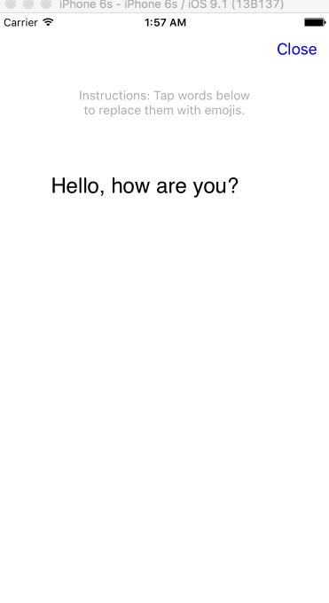
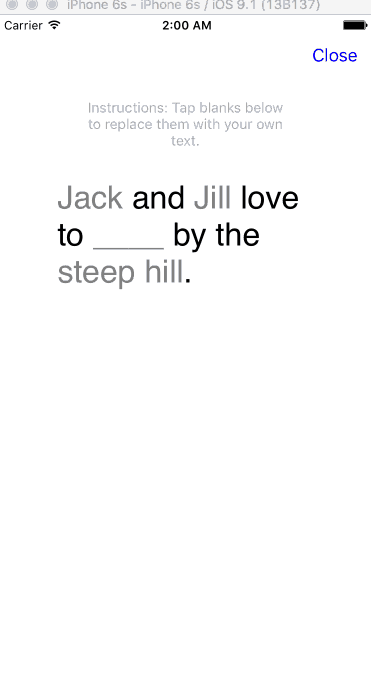
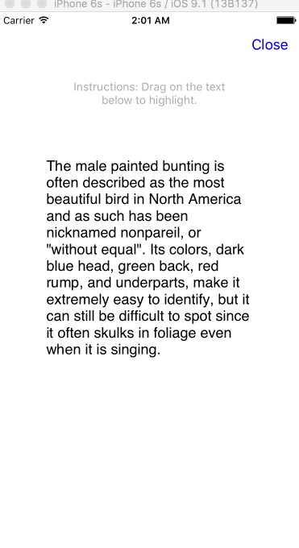

# MSPTouchableLabel


[](https://coveralls.io/github/michaelpace/MSPTouchableLabel?branch=master)


MSPTouchableLabel is a UILabel subclass which provides a UITableView -like interface for creating interactive labels. It has no dependencies.

**The public API of this pod may change since a 1.0.0 release hasn't been reached. Please use caution when upgrading. Not recommended for use in production apps.**

### Installation

Add `pod 'MSPTouchableLabel'` to your Podfile and run `pod install` or `pod update`.

### Usage

Most basic usage:

- Instantiate an MSPTouchableLabel.
- Set the label's dataSource.
- Implement the `MSPTouchableLabelDataSource` method `textForTouchableLabel:`.
- Add the label to your view.

You can optionally implement MSPTouchableLabelDelegate methods to find out about interaction with the label, as shown below:

```Objective-C

#import "MSPTouchableLabel.h"

@interface BasicUsageViewController()<MSPTouchableLabelDataSource, MSPTouchableLabelDelegate>

@property (nonatomic, strong) NSNumber* tapCount;

@end

@implementation BasicUsageViewController

- (void)viewDidLoad {
    [super viewDidLoad];
    
    MSPTouchableLabel* touchableLabel = [[MSPTouchableLabel alloc] init];
    touchableLabel.dataSource = self;
    touchableLabel.delegate = self;
    touchableLabel.frame = CGRectMake(20, 20, 200, 200);
    [self.view addSubview:touchableLabel];
    
    self.tapCount = @0;
}

- (NSArray*)textForTouchableLabel:(MSPTouchableLabel*)touchableLabel {
    return @[@"You have ", @"tapped", @" the verb in this sentence ", self.tapCount.stringValue, @" times."];
}

- (void)touchableLabel:(MSPTouchableLabel*)touchableLabel touchesDidEndAtIndex:(NSInteger)index {
    if (index == 1) {  // index of the verb, "tapped"
        self.tapCount = @(self.tapCount.intValue + 1);
    }
}

@end


```

For larger examples, clone this repository and see the Examples directory. Run the project to see them in action (or glance at the .gifs at the bottom of this document).

### Contributing

1. Fork this repository and make your changes.
2. Write a test which indicates your bug fix or feature's intent and demonstrates that it works as expected.
3. Send a pull request 😁. I'll make my best effort to respond promptly.

### License

MIT

### See also

 - [TTTAttributedLabel](https://github.com/TTTAttributedLabel/TTTAttributedLabel)

### A few example applications:

Replace text upon tap:



Links:


Mad libs:



Highlighting:



